# Dag and Lay Evaluation 

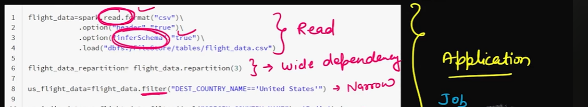

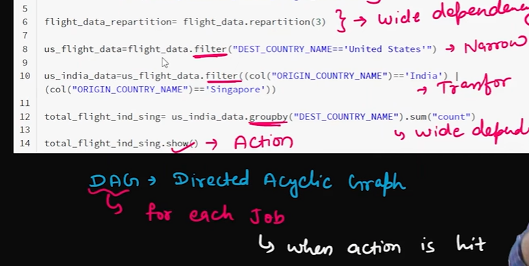

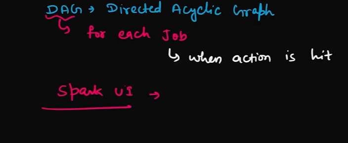

#### on every action there will be one job and every job will have on DAG 

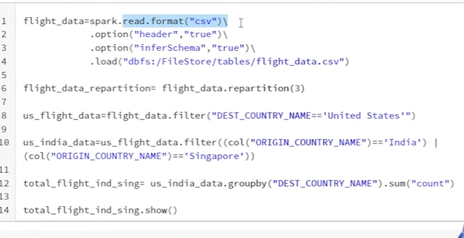

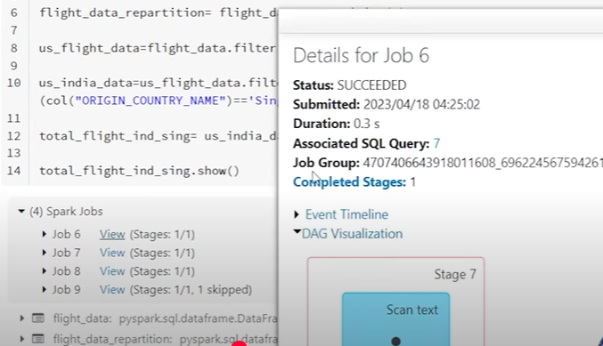
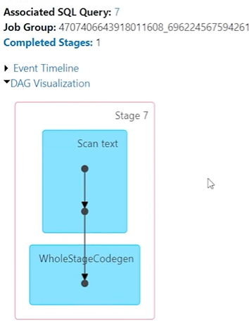
 # job 2 DAG
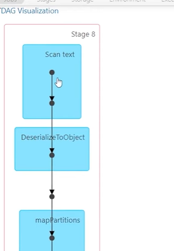

# No actions on these tranformations it is called the lazy transforamtion :
    - this is done to optimize the code 

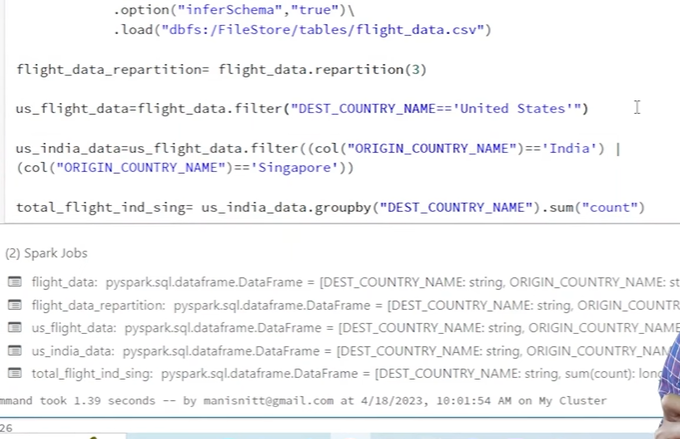

# Optimization of SQL query 
- all the transformation are runned in last with optimizations
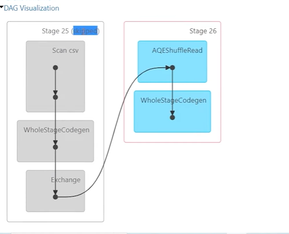
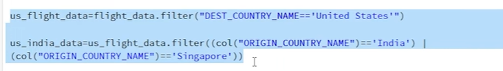

--
 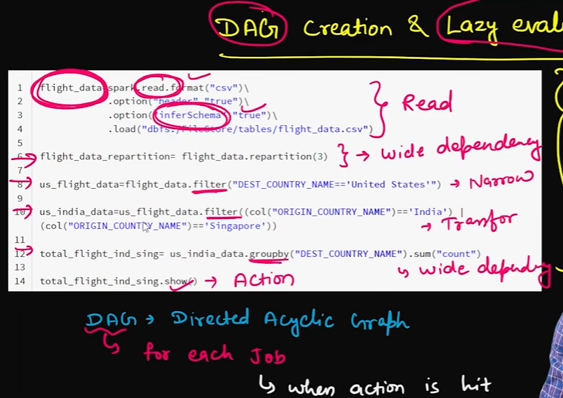

 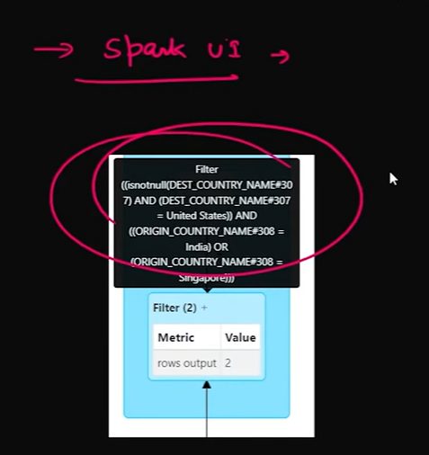