# Repartioning and Coalesce

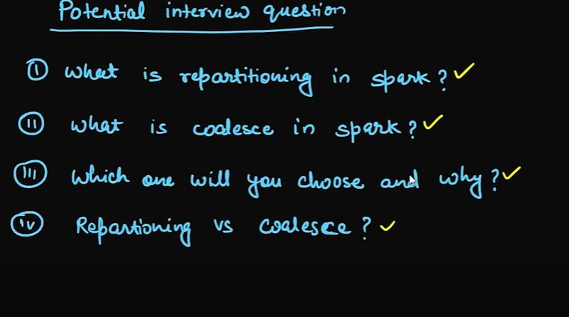

# situaation
    - when there is multiple executer and one executer gets the large chunck of datasets than other has
    to wait for the one and the most of the executers are idle for long time 
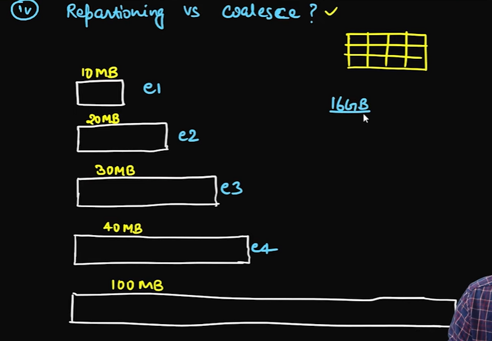

# skewness in data 
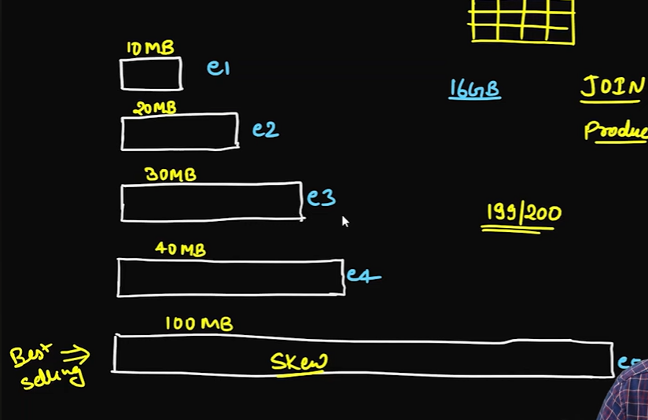

# Partitions  Vs Coalesce 
    - repartioning do the suffling of the data 
    - but coalsece do the merging 
    - partionitn 
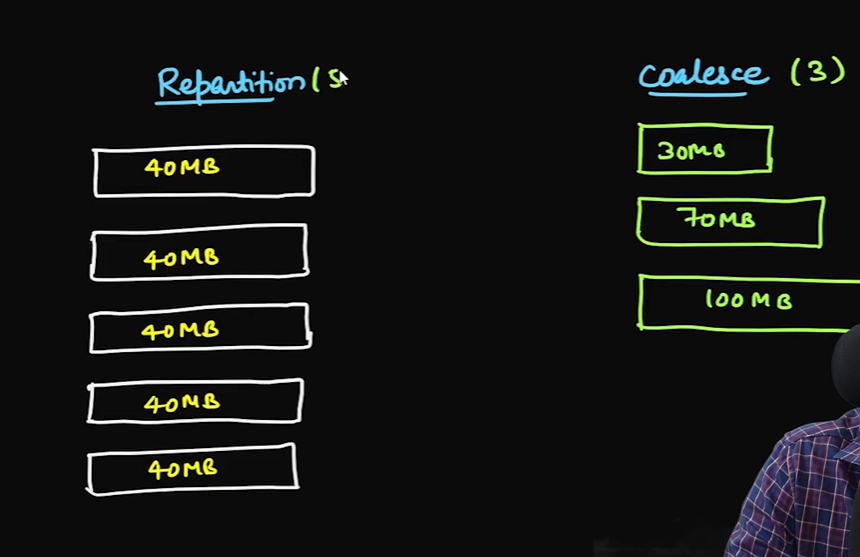

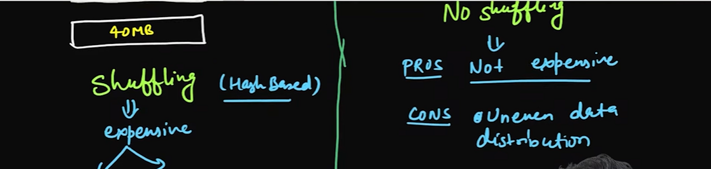
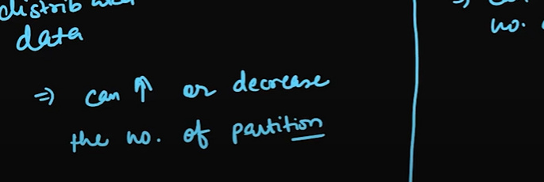

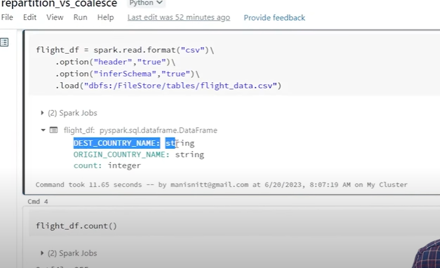

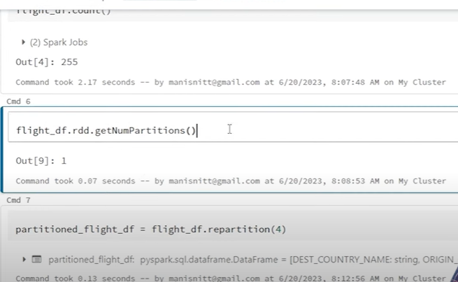

# convert data into the rdd to get number of the partitions : 128 MB's 1 partitions

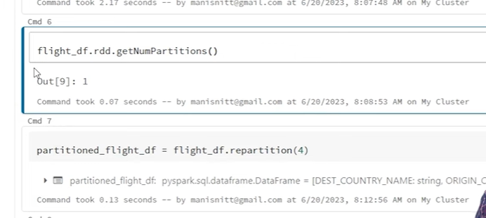

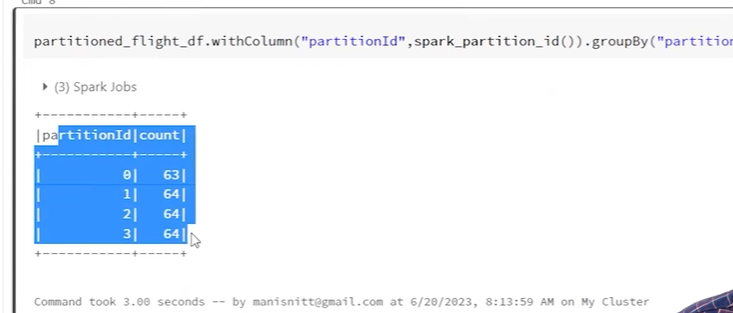

# repartion on based on column : 
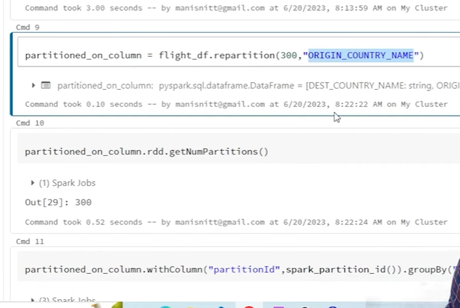

##### will create the null partitions if less records are there 

# Coalesce
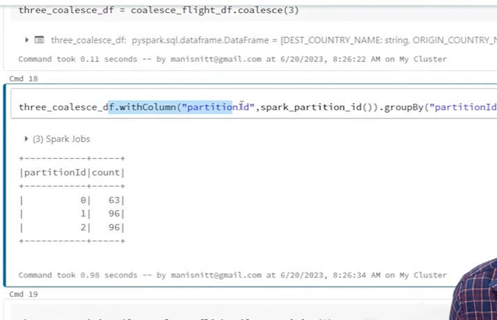
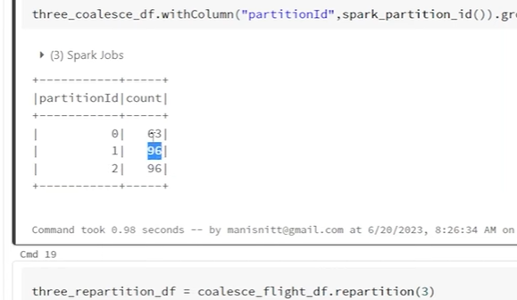

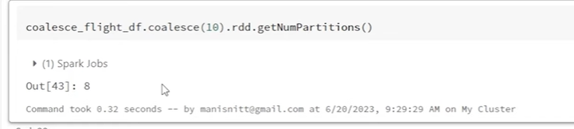