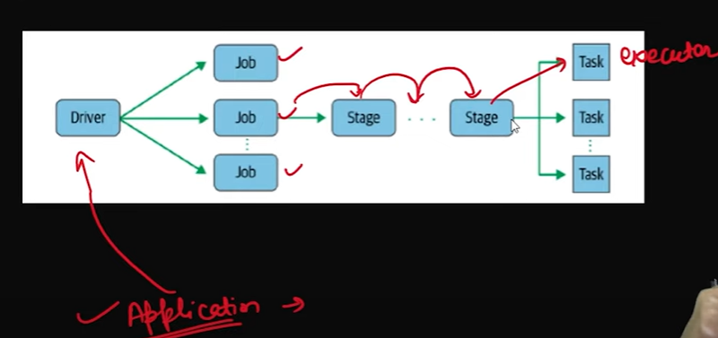
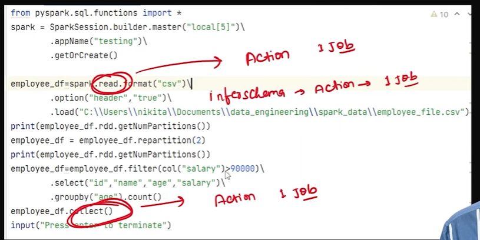
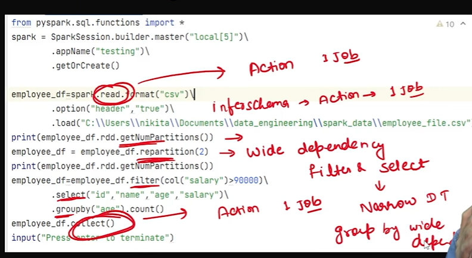
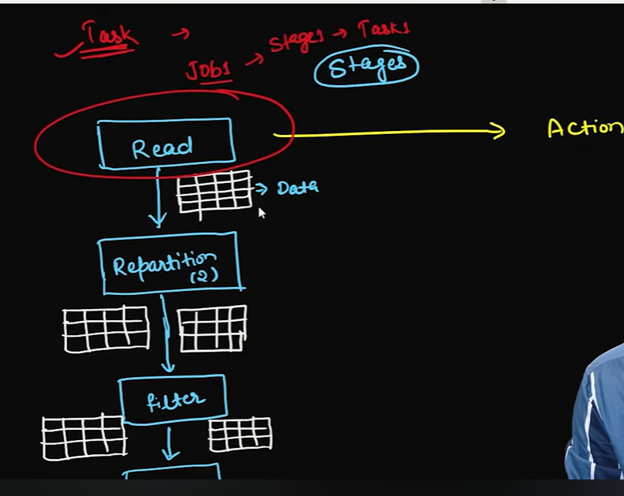
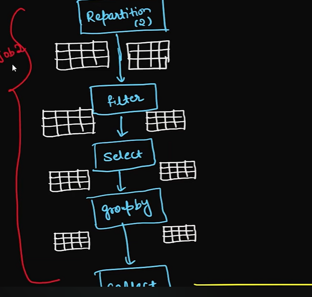
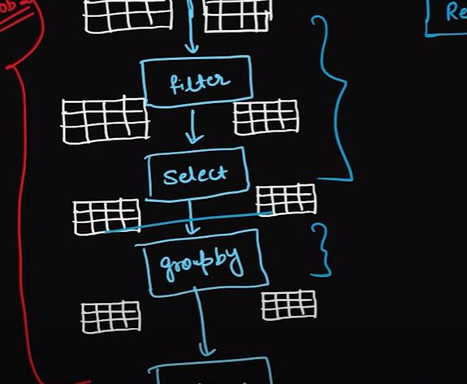
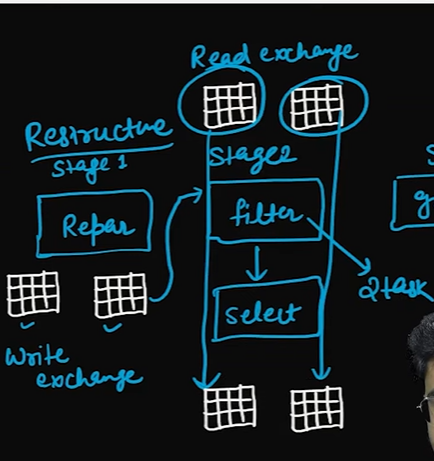
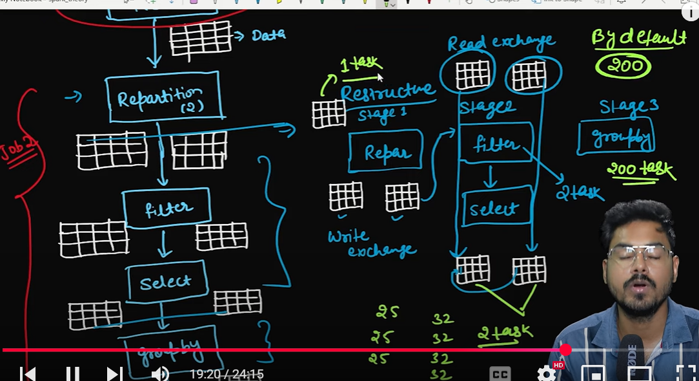
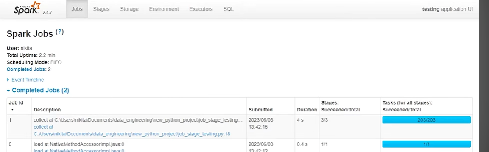
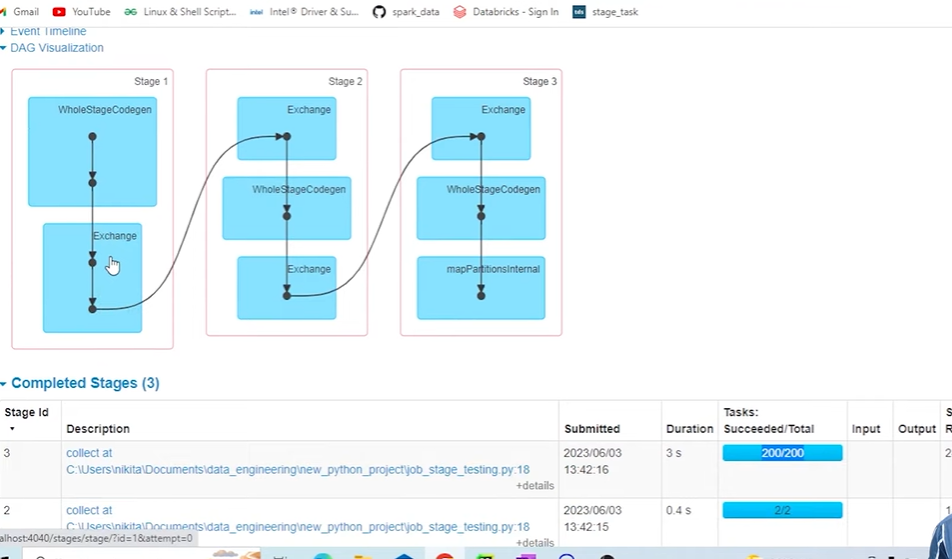

# Spark Jobs, Stages, and Task , Applications

# application: 
- one spark submit command creates the one Application 

# JOb : 
    - in jobs there is lot of actions for the transformation so it is called the Jobs , like 5 action -- 5 Jobs

- ## Stages : 
    - Job is divided into small parts called the stages 
    - steps --> read --> filter --> group ---> join

# Task : 
    - after logical planning the actual execution on executer called task , perform on task 

# So one application will have multiple  job---> multi stages --> task 1, task2, task3 (task depends on num of partitions )

# How many Jobs will be created in below snippet 
 # JOBS 
 

# deep and narrow dependency 
 

# Digram: 

# job 1

# job 2 until the action is not hit

# Stages : 
    - any job will have minimum one stage and one task 

# stages after the repartitions 

# stage 1 was created on job1 
# job 2 stages: 

# write exchange and wide dependency transformation , data suffeled 

#### 200 partitions by default in the group by 

- partitons = 200 tasks 

# final tasks

