# Spark_Join_Suffle_sort

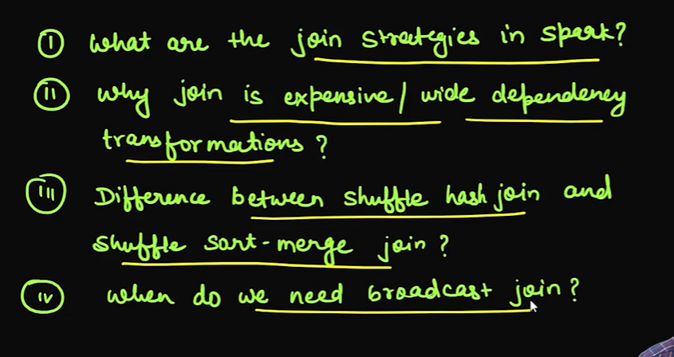

# Data Distribution

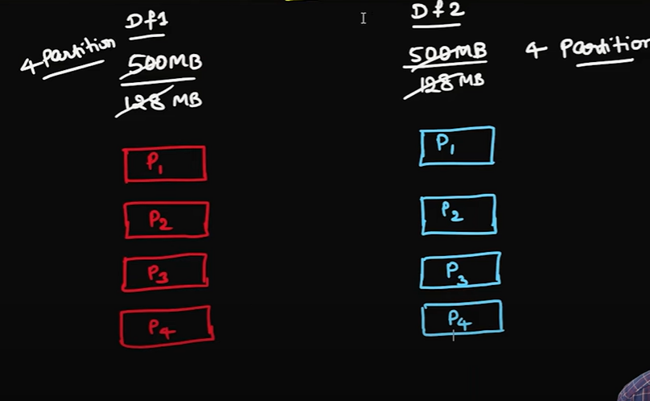

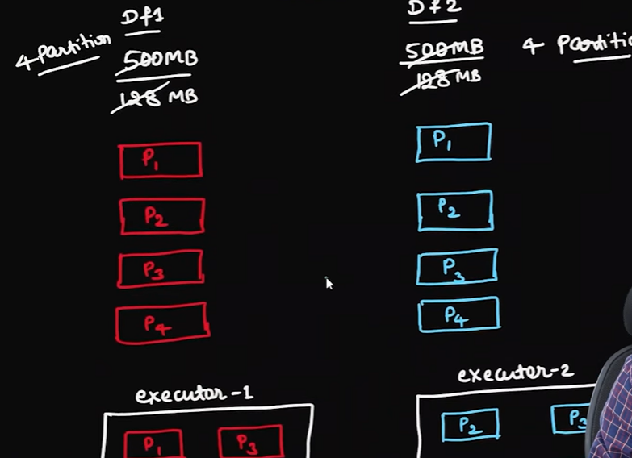

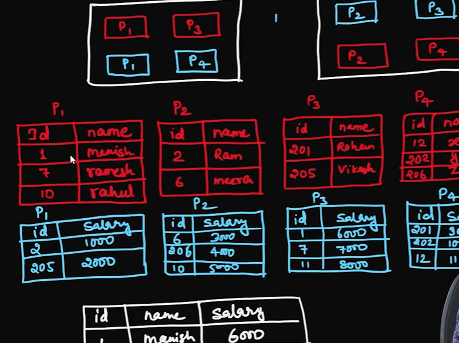

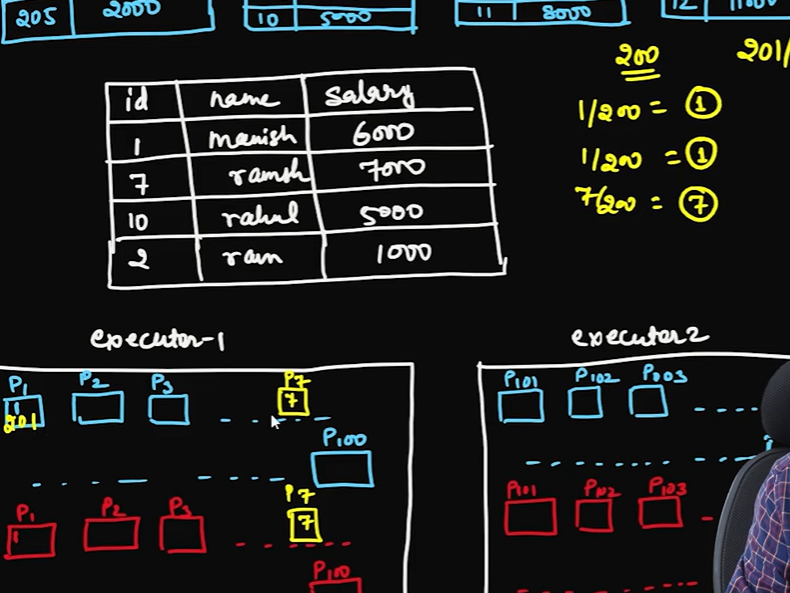

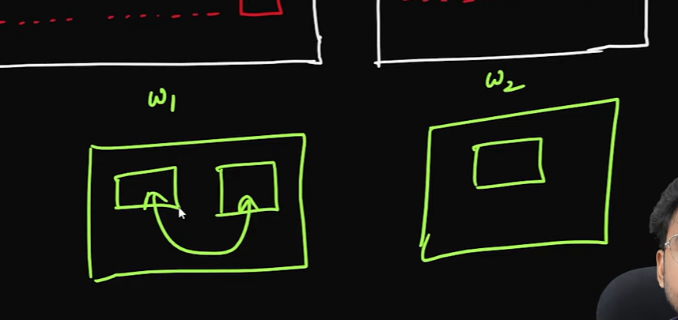

# Join Strategies in Spark 

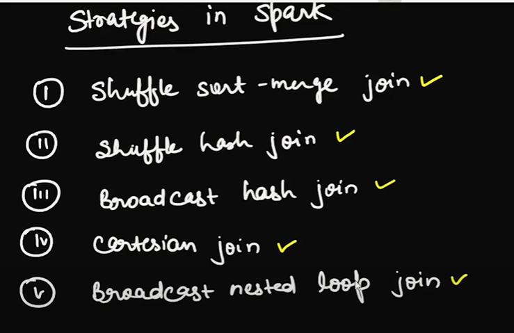

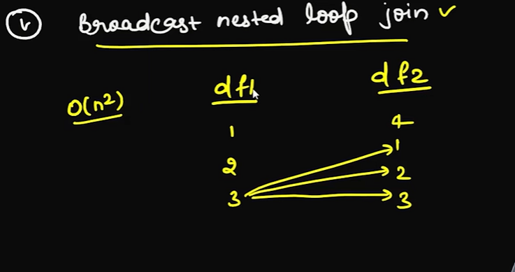

# Suffle sort merge join 
    - olog(n)
    - utilize the cpu 
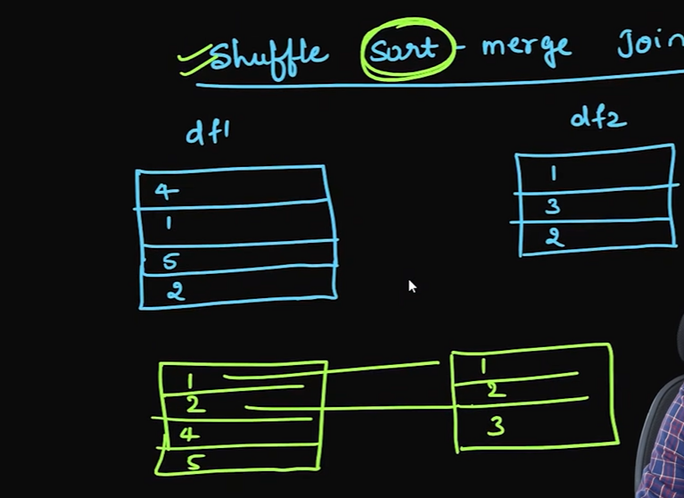

# Suffle Hash Join 
    - It will use the memory to do hashing 
    - 0(1)
    - if there is memory in executor then it will be suitable 

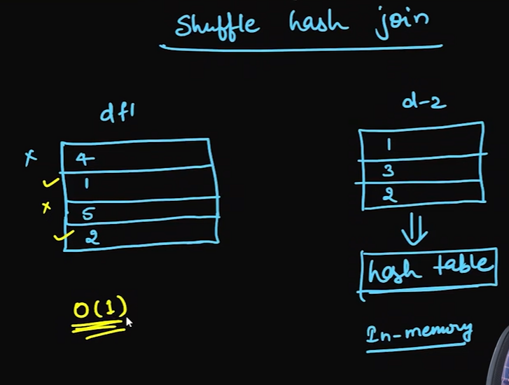

#
# Broadcast Hash Join 
    - decide the size of the broadcast data based on your  cluster size 
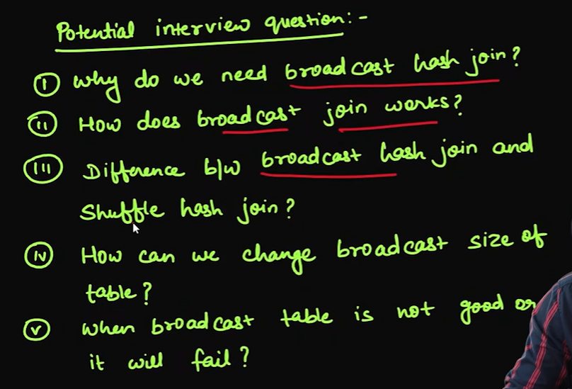

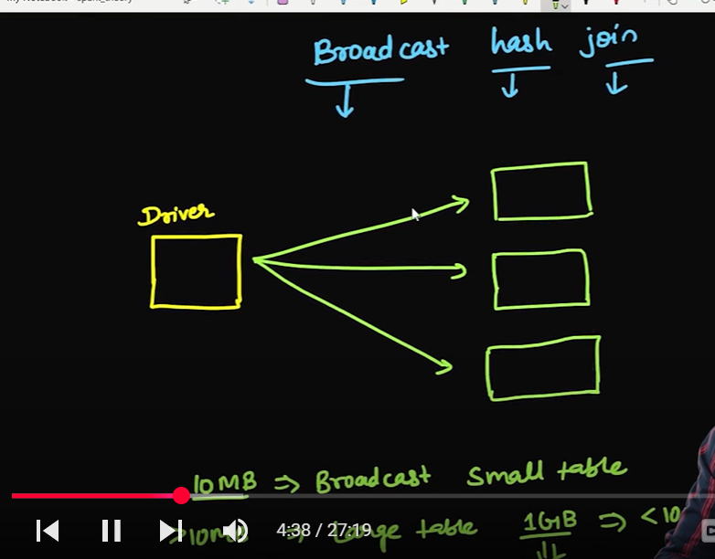

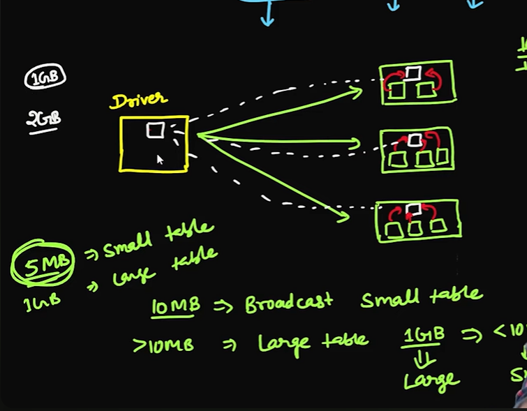

# example 
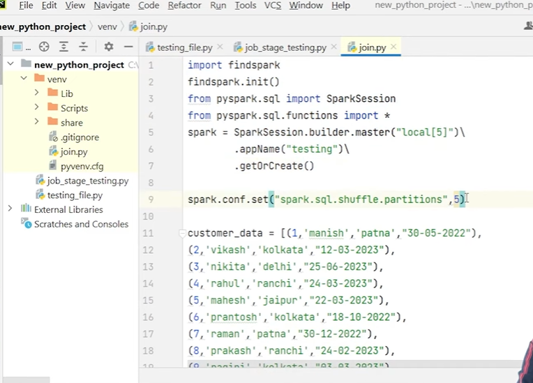

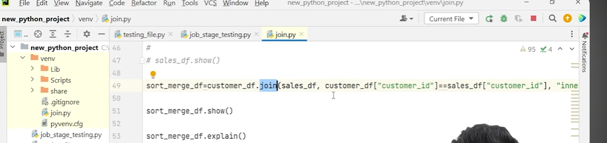
# sort_merge_plan to see the physical plan 

