# Spark Memory Management 

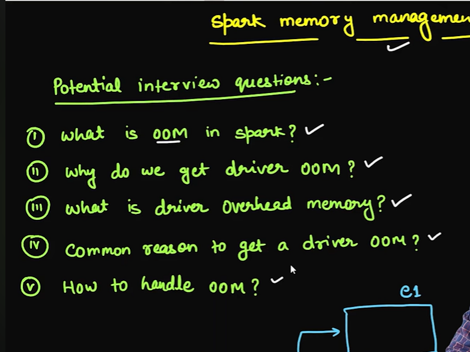

# what is OOM in Spark 

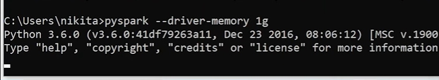

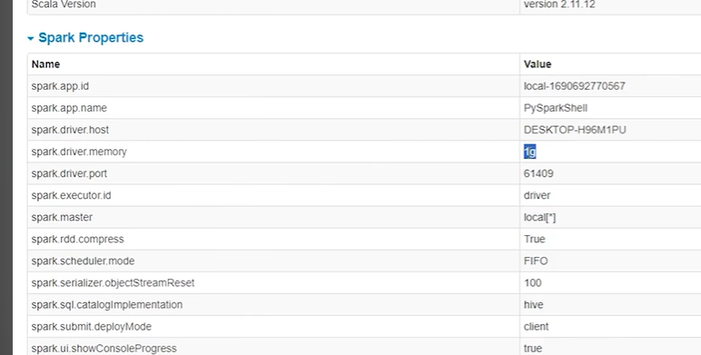

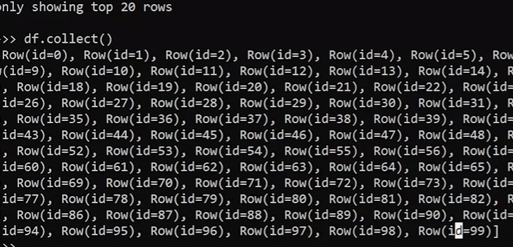

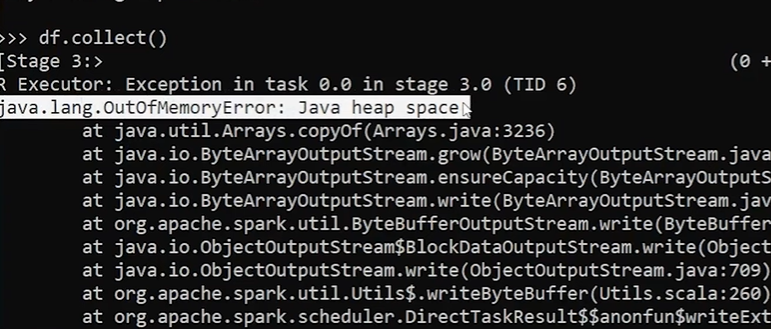

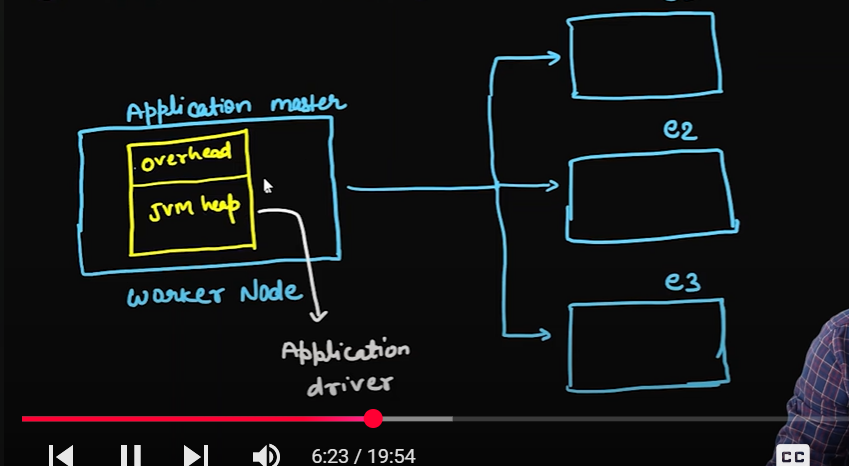

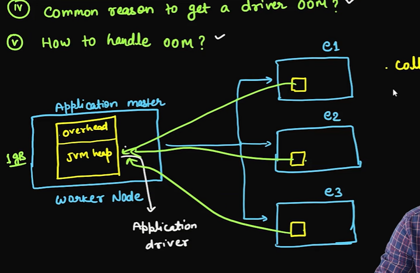

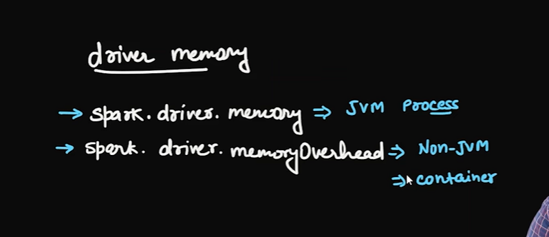

# Executor out of memory 

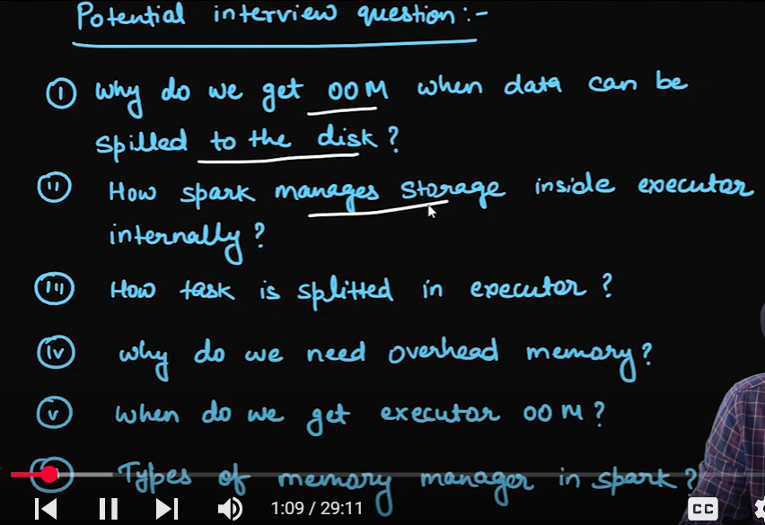

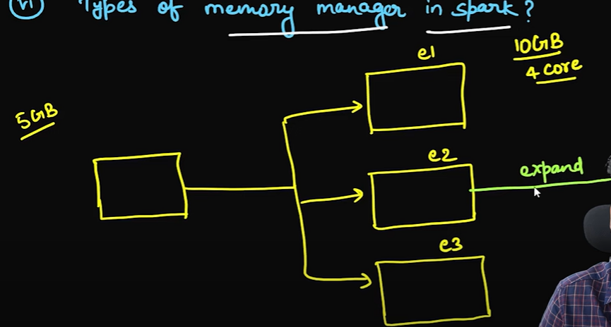

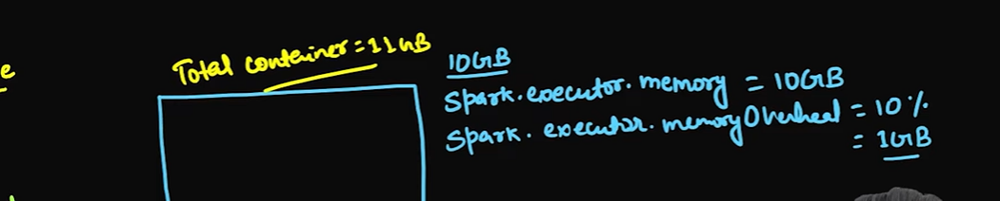

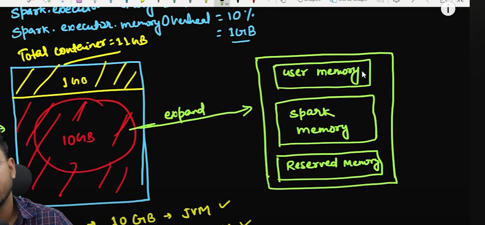

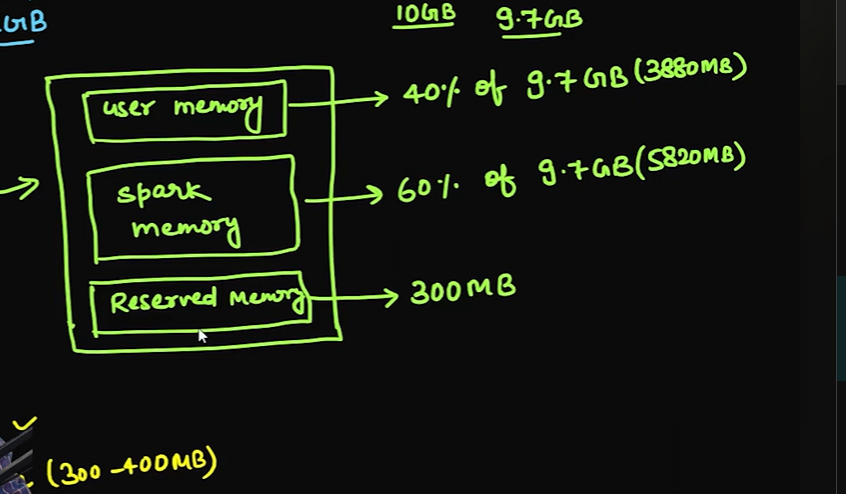

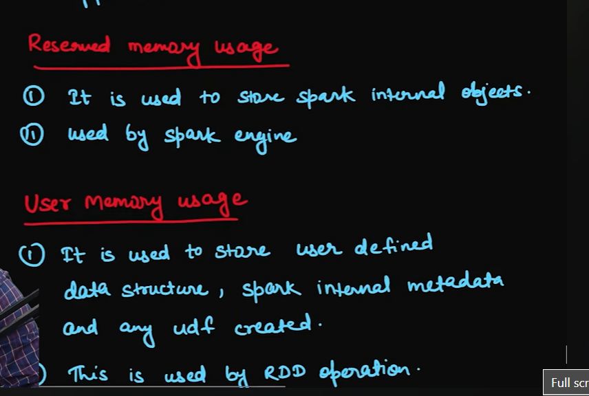

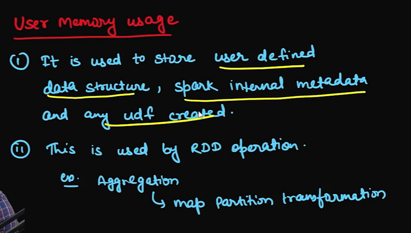

# If operations are written for RDD than it will use the user memory
# for dataframe it will use the spark frame 

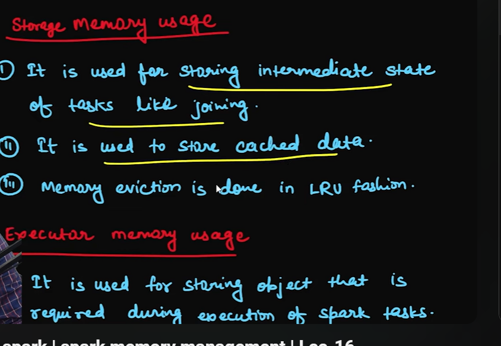

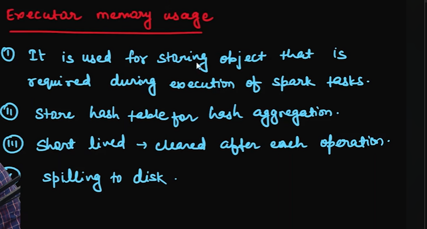

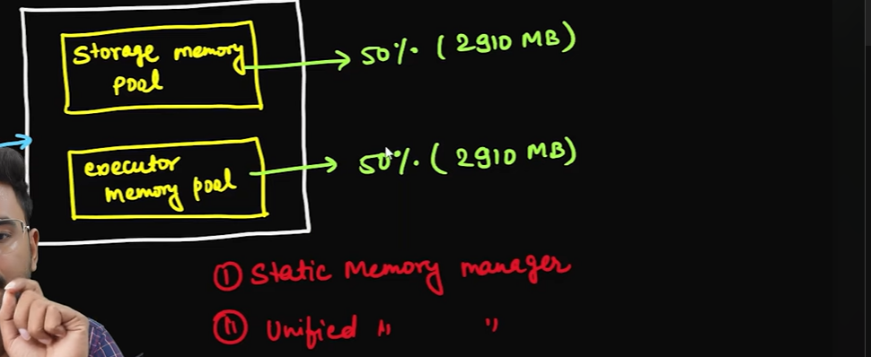

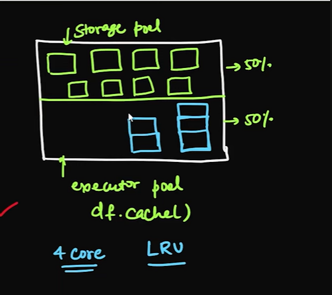

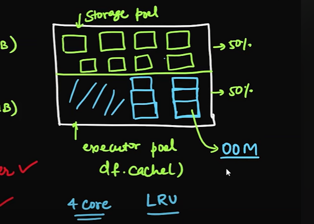

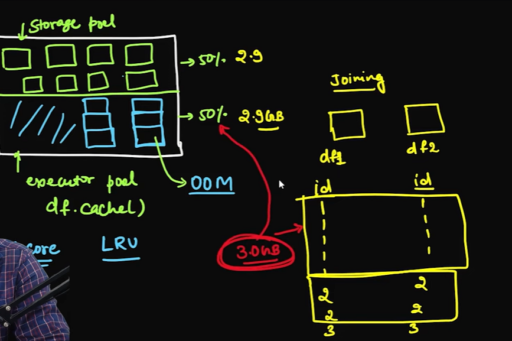

# salting and repartioning 
- 3-5 core per executor 
