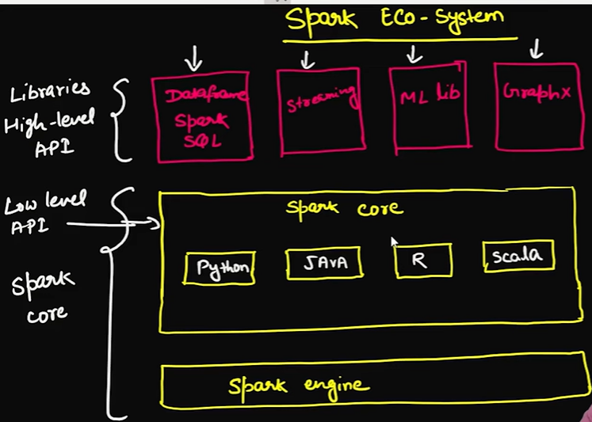
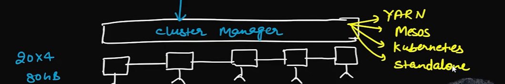

# spark - eco-system 
    - it is written in scala 
    - In low level we makes use of the RDD(resilient distribute datasets) in spark core for low level implementation: 
    - High level : in dataframe or datasets 

# cluster Manager 

