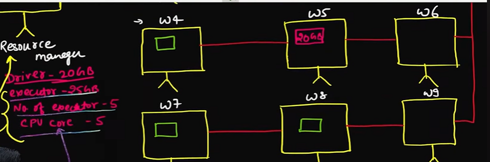
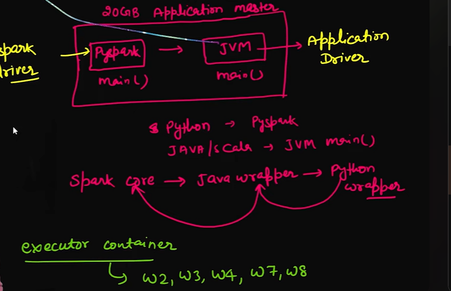
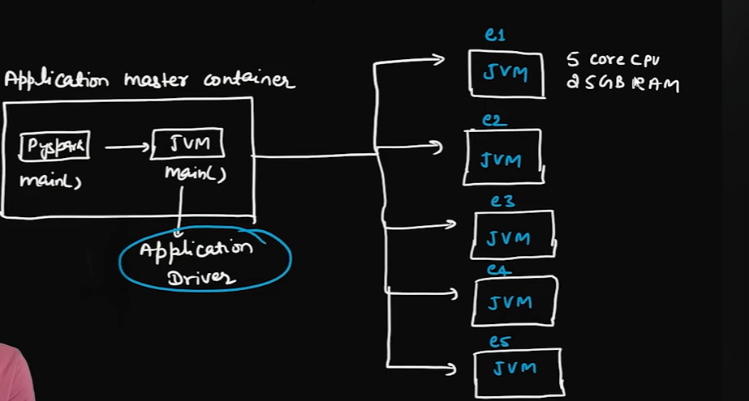
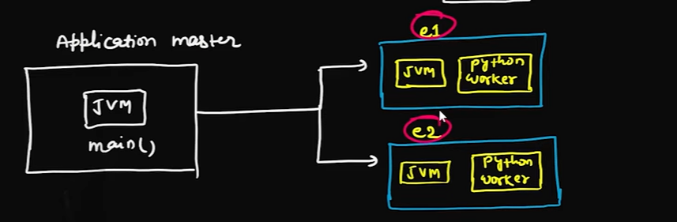

# spark - eco-system 
    - it is written in scala 
    - In low level we makes use of the RDD(resilient distribute datasets) in spark core for low level implementation: 
    - High level : in dataframe or datasets 

# cluster Manager 

# 
# Spark Architecure: 

## cluster size : 
    - 20 core per machine
    - 100 GB RAM 
    - total machine = 10
    = 200 core , 1 TB RAM 

#   Master node (1)
         |       |
   |------------>|
   |     |       |----->(Resource manager : [YARN or Kubernetes])|
   |     |                                                       |
   |     |                                                       |   
   |     |-----> worker nodes (9)[w1,w2,----w9]             <----| {w5: create 2ogb ram container, by executer}      
   |                                                          
   |
   |
   |------->{Developer: [Spark submit]
            - spec:
            Driver: 20GB
            executor: 25GB
            no of executor: 5
            cpu core : 5    }

# Container : 
    - Application Master (container Name , EntryPoint )
    - code : Python --- > PySpark (Driver)
    - Java - JVM Main
    - Note spark always run on JVM as built on scala 
 ## Container Working 
    - JVM as a application driver request for the container creation 
       

    

    

    # If in above architecuture there is any user defined function in pyspark then the jvm can't run so have to change the architehture
    - so there will be py worker in every container if there is UDF , 
    

    # If the app driver close then executer will be closed 
    