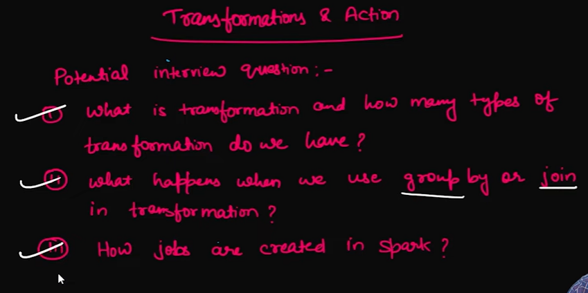
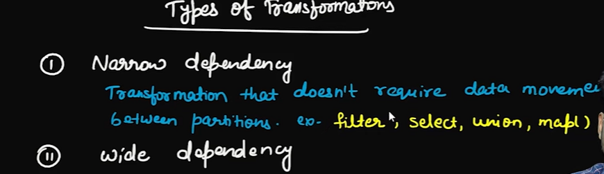
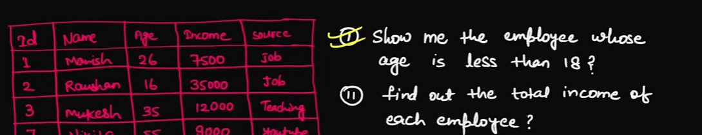
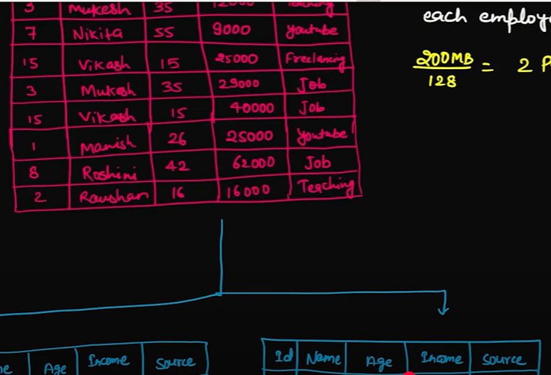
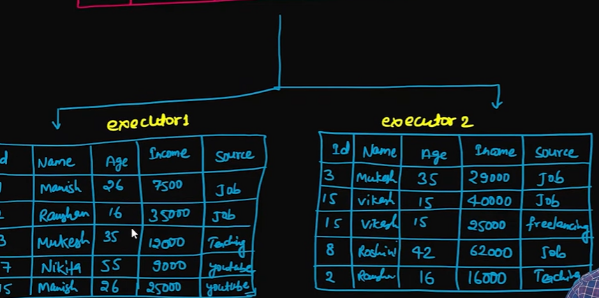
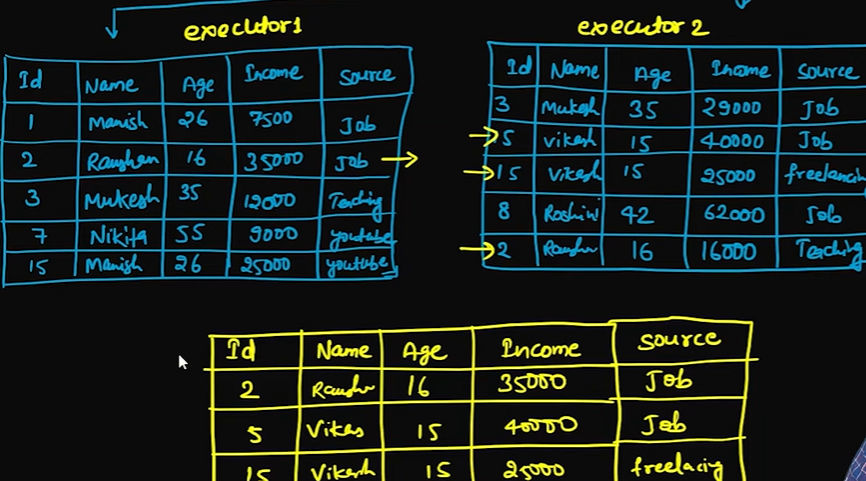
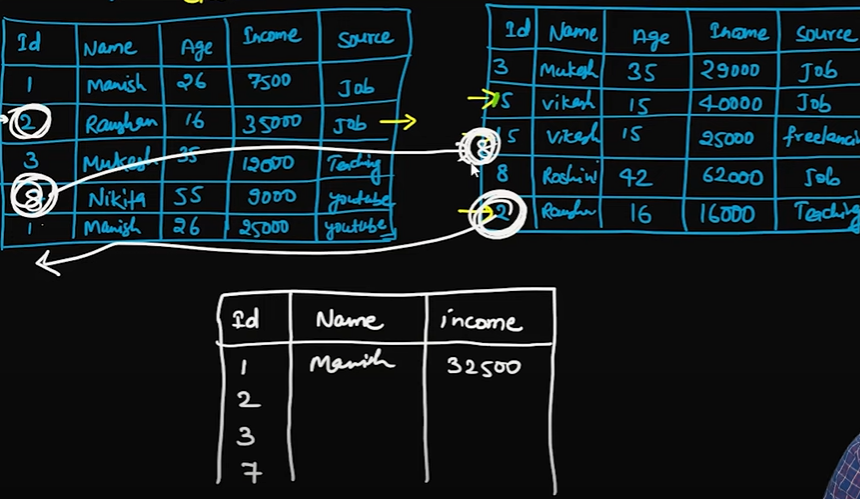

# Transformations in Sparks 

- Filtering the records by joins,groupby will be called transformations means data is processed
- Actions: .show , .count, collect  (when the action is not hit till then the job is created and run one by one , so data will collected by collect actions on driver by executor, (for large data driver may be out of memory or failed )transformation is done)

# Types of Transformations : 

# Wide dependency : 
    - if the data transofrmation is moving with another executor which haves dependencies like  join , gorupby 

# Question 1 Result 
    - no data needed to be moved both executor done its work 

# Question 2 by groupBY

    - Data will be suffeled b/w executor for id 2 to add total income 
    - data will be moved for more partitions so it will be expensives

